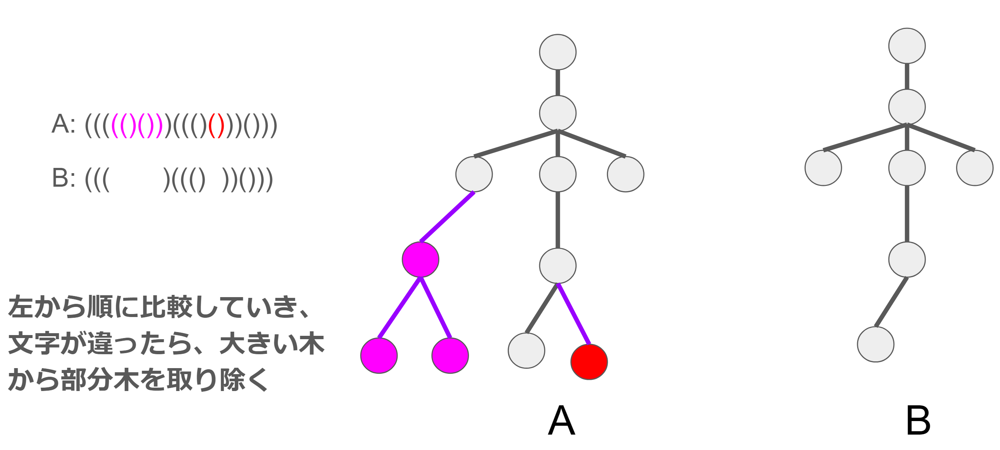

# Babylon.jsゆるほめLT会に登壇しました
発表時タイトルは「bjs製の自作ポートフォリオサイト」としましたが、**実質ボーン階層の抽象化の話になりました。**



<a href="https://www.docswell.com/s/udemegane/5MRDGK-2022-07-18-081558">babylon.jsゆるLT資料: ボーン階層を雑に扱いたい by @udemegane</a>



# 本題

上記LTで発表した内容の通りですが、babylon.jsではボーン階層の抽象化しアニメーションクリップをモデルから分離する仕組み、UEでいうところのSkeletonが存在しません。

これはキャラクターアニメーションアセットを扱う際にかなり厳しい制約であり、キャラクターアニメーションを扱いたくば一つのアセットの中に必要なアニメーション全てを含めてbjsでインポートする必要があります。 

それではアニメーションアセットの再利用性皆無な上に非常に扱いにくく、無いと困るのでこれを実装したいですが、結構難しい作業であることは想像に難くありません。とりあえず、本当に単純な場合から考えて実装していきます。  
現時点ではglbでメッシュもアニメーションも同時にインポートしないとアニメーションが適用できないので、それらがバラバラにインポートでき、多少はボーン階層が違っていても(一応)使いまわせることを目標にします。具体的には、アニメーションを使いまわすスケルトンの組A,Bがあるとき、どちらかがもう一方のサブセットであれば許容します。(例えば、ある人型スケルトンAがあり、そのスケルトンに髪の毛のボーンやスカートのボーンを加えたスケルトンBがあるとき、AはBのサブセットです)  

今回はボーン(Node)に結びついたアニメーションデータを他スケルトンに適切にマッピングすることを行います。アニメーションデータそのものに変更は加えません。つまり、アニメーションを使いまわすモデル間で体格・バインドポーズはほぼ同じ場合を想定します。(これが違う場合、多分腕がひん曲がったり怪しい挙動を始めることになります。)  

スケルトンの互換性判定ですが、木を文字列に変換する技を使用して判定します。
参考: https://chocobaby-aporo.hatenablog.com/entry/2017/12/05/233027

変換法はシンプルで、全てのノードに対して以下の操作を行います。
1. 子が持つ文字列をソート順で連結
1. 両端を"("と")"で閉じる
この操作を終えたとき、ルートが持つ文字列がその木と対応する文字列でありこの文字列が一致すれば木構造も一致します。  
詳しいことは上記の記事を参照してください。(僕は競技プログラミング一ミリもわからないです)

上記の文字列変換を応用して2つの木A,Bが合った時、どちらかが一方の部分木であるかを判定します。  
考え方としては仮に部分木であれば余分な木を取り除けば2つの木は完全一致するので、余分だと予想される箇所を取り除いてから文字列が一致するかを調べます。

上の図だとBはAの部分木です。文字列を一文字ずつ比較していき、違った場合は"("")"で囲われた部分を取り除きます。

文字列を走査し終えた状態で改めて文字列AとBを比較して一致すれば判定できます(多分)。

とりあえずこれでスケルトンツリーの論理的構造の比較は最低限行えるでしょう。。。
次回の記事は[こちら]()

---
以下のリポジトリで作業を行っています。
- https://github.com/udemegane/bjs-asset-host-analyze.git
- https://github.com/udemegane/bjs-character-animation-sample.git

