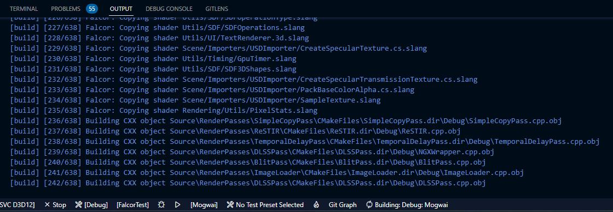
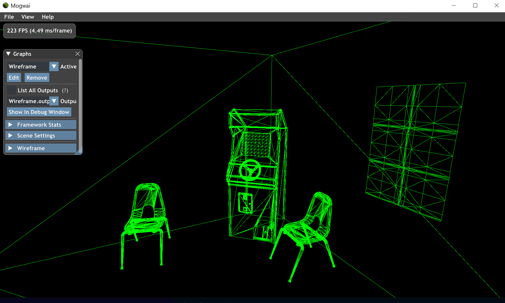

ラスタライズとレイトレースを統合して扱えるｲｲｶﾝｼﾞﾚﾝﾀﾞﾘﾝｸﾞﾌﾚｰﾑﾜｰｸことFalcorを触ってみる記事です。
環境構築に関しては先駆者もそれなりにいますがVisual Studio以外でのビルドをしている人はあまり見かけないのでVSCodeでビルドしました。  
問題はチュートリアルで、**ドキュメントがめっちゃ古くて書いてある通りやってもコンパイルエラー吐くんですよね。**　多分2~3年間更新されていないのでチュートリアル通りに進めても動きません。CLion君が優秀でこのコード嘘じゃんね！！って速攻教えてくれたので助かった...  

ドキュメント自体も必要最低限の量しかないです。  
それでも定期的に開発は続いておりStarも1000超え、2021年のCEDECではバンダイナムコスタジオがFalcorで物理ベースレンダリング検証を行ったセッションが開かれていたことを考えると結構人気がありそうですね。  
リアルタイムレンダリング分野でR&Dっぽいことをする人からするとドキュメントなんか無くても無問題！って事なんですかね。怖いですね～～～。

**なお、本記事執筆に当たってはVersion5.2を使用しています。それ以降のバージョンではここに書いてあることも古い可能性があるので注意してください。**

## 環境構築
[README](https://github.com/NVIDIAGameWorks/Falcor#readme)に書いてあることにそのまま従えば問題ありません。  
以前、[submoduleのパスがgithubではなくnvidia内部のgitlabに向いている](https://github.com/NVIDIAGameWorks/Falcor/pull/327)ときがありましたが、今後またそのような事が起きてもそのサブモジュールに相当するものを手動でgithubからcloneすれば一応動くと思います。  
VSCodeの場合、`setup.bat`を実行し、presetを`windows-ninja-msvc-d3d12`にしてビルドします。  
[色不異空氏の記事](https://shikihuiku.github.io/post/falcor_getting_started/)のように、最初はFalcorTestをビルドすると良さそうです。　　

Ryzen9 3900Xでビルドしましたが、そこまで大きなフレームワークではないのでコーヒー淹れる間に終わるでしょう。

---
## Writing Shadersチュートリアル
先ほど述べたようにチュートリアルは一部壊れているので、そこは自分で直します。壊れているといっても一部のAPIが更新されていて使えないだけなので概ねチュートリアルの通りに進めることができます。

ソースコードは以下にあります。  
https://github.com/udemegane/Falcor-playground/tree/main/WireframePass

Writing Shaderチュートリアルで作成するのはワイヤーフレーム表示をするパスです。
完成すると以下のような絵を得ます。


まずは新しいレンダーパスを追加します。`tools/make_new_render_pass_library.bat <LibraryName>`で作成できるのでWireframePassという名前で追加したければ、
```
tools/make_new_render_pass_library.bat WireframePass
```  
とします。
これで`Source/RenderPasses`に新しくWireframeディレクトリと以下の３ファイルが追加されます。
```
-|
 |-CMakeLists.tex
 |-WireframePass.cpp
 |-WireframePass.h
```
最初にシェーダーを用意しましょう。Falcorではhlslを拡張した[Slang](https://github.com/shader-slang/slang)を使います。(一応hlslでもできるみたいです)  
以下は単色で塗りつぶすピクセルシェーダーとFalcorが標準で提供する頂点シェーダーを使うサンプルです。
```java
import Scene.Raster; // Imports defaultVS.

cbuffer PerFrameCB
{
    float4 gColor;
}

VSOut vsMain(VSIn vIn)
{
    return defaultVS(vIn);
}

float4 psMain()
    : SV_TARGET
{
    return gColor;
}

```
ピクセルシェーダーと頂点シェーダーを一つのファイルに作成しましたが、その場合名前は慣習的に<SHADER_NAME>.3d.slangとするらしいのでWireframe.3d.slangとしておきましょう。HWRTシェーダーの場合<SHADER_NAME>.rt.slangなどとするようです。  
作成したシェーダーファイルをビルドの対象にします。CMakeLists.txtを編集します。
```CMake
add_renderpass(WireframePass)

target_sources(WireframePass PRIVATE
    WireframePass.cpp
    WireframePass.h
    WireframePass.3d.slang
)
target_copy_shaders(WireframePass RenderPasses/WireframePass)

target_source_group(WireframePass "RenderPasses")
```
次にC++側の作業です。先ほどのスクリプトによって大枠は組まれています。  
`execute()`以外はチュートリアルに沿って進めれば問題ありません。

コンストラクタ、`reflect()`、`setScene()`を実装します。

`execute()`に使われている`Scene::Renderflags`は現行バージョンでは廃止されて存在しません。ここをチュートリアルとは変える必要があります。
Renderflagsは無くなりましたが作成したRasterStateの情報は渡したいので、`rasterize()`に直接渡します。

```C++
void WireframePass::execute(RenderContext *pRenderContext, const RenderData &renderData) {
    auto pTargetFbo = Fbo::create({renderData.getTexture("output")});
    const float4 clearColor(0, 0, 0, 1);
    pRenderContext->clearFbo(pTargetFbo.get(), clearColor, 1.0f, 0, FboAttachmentType::All);
    mpGraphicsState->setFbo(pTargetFbo);
    if (mpScene) {
        mpVars["PerFrameCB"]["gColor"] = float4(0, 1, 0, 1);

        mpScene->rasterize(pRenderContext, mpGraphicsState.get(), mpVars.get(), mpRasterState, mpRasterState);
    }
}
```
あとはWireframePassをビルドして問題ないか確認します。  
問題なければWireframePass用のレンダーグラフを作成しましょう。
レンダーグラフといっても使うパスは今回作成したWireframePassだけです。　　
```Python
from falcor import *

def render_graph_WireframePass():
    g = RenderGraph('WireframePass')
    loadRenderPassLibrary('WireframePass.dll')
    Wireframe = createPass('WireframePass')
    g.addPass(WireframePass, 'WireframePass')
    g.markOutput('WireframePass.output')
    return g

WireframePass = render_graph_WireframePass()
try: m.addGraph(WireframePass)
except NameError: None
```

ここまで来たらあとはMogwaiを起動し、Load Scriptで作成したpythonスクリプトを読み込み、Load Sceneで好きなシーンを読み込みます。今回はチュートリアルと同じく`media/Arcade/Arcade.pyscene`を読み込みました。  
下記画像が正常に表示されれば完成です。


記事を書いてから気が付きましたが誰かが壊れたチュートリアルのIssueを出しているようですね。あとでプルリクを出しておきます。  
ただ、他のIssue見るとどうやら次期アップデートでラスタライズパス全消ししてリアルタイムパストレーシングに特化するらしいんですよね。個人的にはラスタライズとハードウェアレイトレースを統合して扱えるところが気に入っていたのですが...  
もしかしたらこの記事の内容は短い命かもしれません。

追記：プルリクがマージされました。チュートリアルは治っているはずです。
