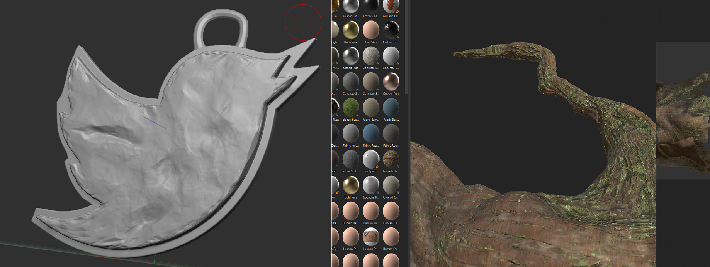
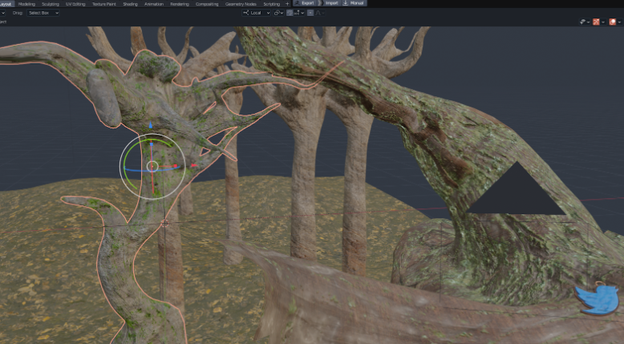
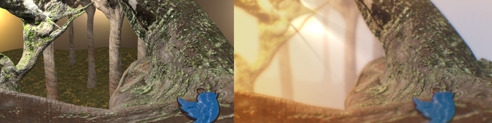
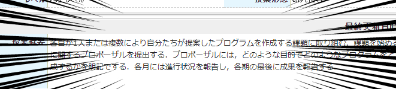

タイトルの通り。2~3年前から作ろう作ろうと思いながら全く手を付けられていなかったが、就活の時期も近いので作ることにします。

普通のWebサイトにしても何も面白くないのでフル3DCGで作りたいですね。以下の機能があるとテンションが上がります。
- 自作キャラクターが居て生活している。
- twitterやらgithubやらのアイコンが自然に存在していて、押すと私のページに飛ぶ。
- なんかかっこいい  

[Babylon.js](https://www.babylonjs.com)というWebGLフレームワークを使用します。

## というわけで
作りましょう。
まずは背景シーンをZBrush+Maya+Substanceで適当に作りました。

私は背景モデラーではないし、目指してもいないのでクオリティがちょっと残念ですがポストプロセスで誤魔化すので問題無し。

最終的には.babylon形式でアプリケーションに突っ込んだほうがBjsを使う場合色々と楽なのでBlenderで変換します。MayaにもBabylon.jsプラグインが一応ありますが、試したところ恐ろしく動作が遅いので素直にBlenderに持って行って変換したほうが楽でしょう。Blender pluginとMaya pluginでどうしてあんなに速度に差があるかは謎。どっちもPythonなのでオーバーヘッドになっているのは多分MayaのAPIでしょうね。

## Babylonjsアプリケーション
以下のリポジトリで作業しています。
https://github.com/udemegane/udemegane.net

TypeScript+Webpack+babylon.jsの構成です。
テスト駆動開発でもするかぁと最初は思ってましたが勢いで作ったせいでテストとか全然書いてないです。テスト駆動開発を敢行するには強力な精神力が必要。。
とりあえず作った環境を入れてポストプロセスを色々かまします。

その結果[激重Webサイト](https://udemegane.net)になりました。これどうにかしないとダメだよなぁ。
それとキャラクターも入れたいですが、babylonjsのアニメーション周りがとにかく扱いづらいのと、そもそもキャラクターが完成してないので次はその作業です。

## 個人開発で単位がもらえる、嬉しい！！
これ実は大学の授業の課題も兼ねてるので7月末までには完成予定です。というか完成させないと私の単位が危ない。

**追記:完成していないですが持前のプレゼン力によって無事A+がもらえた。やったぁ()**

おめー普通の情報系の大学院通ってるのに大学の講義でテーマ自由の個人開発なんかあるわけないだろ、と思った方もいらっしゃるかもしれない。  
**あるんだなこれが！！！！！！**  

