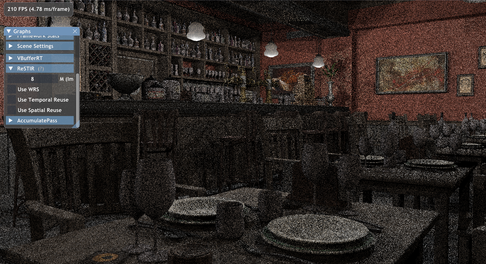

Twitterで観測するｸﾞﾗﾌｨｯｸｽｴﾝｼﾞﾆｱがみんな再現実装していることで有名なReSTIRをFalcorで実装します。

ReSTIRとは、Reservoir-based Spatio-Temporal Importance Resamplingの略で、Nvidia Researchが開発したレイトレーシングによる直接照明計算の分散を大幅に低減するアルゴリズムであり、WRSによって、現在ピクセルに対して寄与の大きなライトを効率的に選択できる良いPDFを計算します。  
さらに周辺ピクセルも考慮するSpatial Reuseと前フレームも考慮するTemporal Reuseを合わせて使用することでRISのサンプル数を増やすことで計算精度を高めています。  
詳しくは[元論文](https://research.nvidia.com/publication/2020-07_spatiotemporal-reservoir-resampling-real-time-ray-tracing-dynamic-direct)を見てください。  
また、この手法の中核アルゴリズムは[Shocker氏の記事](https://rayspace.xyz/CG/contents/weighted_reservoir_sampling/)が大変参考になります。  
[謎の犬が喋るこの動画](https://www.youtube.com/watch?app=desktop&v=gsZiJeaMO48)もかなり分かりやすいです。

とりあえずWRSだけ実装しました。Temporal/Spatial Reuseは作業中ですが近いうちに実装すると思います。

<br>

ソースコードはこちら↓  
https://github.com/udemegane/Falcor-playground/tree/main/ReSTIR

---

[slang言語](https://github.com/shader-slang/slang)ではReservoirは例えば以下のように実装できます。
```C#
struct RISReservoir<S>
{
    float wSum;
    S currentSample;
    float targetPdfSample;
    uint M;
    __init(S sample)
    {
        wSum = 0;
        M = 0;
        currentSample = sample;
        targetPdfSample = 0.f;
    }
    [mutating]
    bool update(S xi, float wi, float pi, float rand)
    {
        wSum += wi;
        M++;
        bool accept = rand <= wi / wSum;
        if (accept)
        {
            currentSample = xi;

            targetPdfSample = pi;
        }
        return accept;
    }

    float getInvPDF()
    {
        return wSum / (M * targetPdfSample);
    }
}
```

このReservoirを使用して、Falcorで光源選択をする場合は以下のように実装できます。
```C#
RISReservoir<uint> r = RISReservoir<uint>(lightIndex);
        for (uint i = 0; i < kRISSampleNums; i++)
        {
            float2 rand = sampleNext2D(sg);
            // Sample LightID from uniform distribution
            const uint xi = min(uint(rand.x * lightCount), lightCount - 1);

            AnalyticLightSample ls;
            // Calculate from target distribution Fs*G*Li
            float3 pi3f = float3(0.f);
            if (sampleLight(sd.posW, gScene.getLight(xi), sg, ls))
                pi3f = bsdf.eval(sd, ls.dir, sg) * ls.Li;

            // Calculate weight proportional to p(xi)/q(xi).
            // q() is uniform distribution, Always Return 1/LightCount.
            // p(xi) is Fs*G*Li. (exclude V())
            // So weight us pi * lightCount.
            float pi = length(pi3f);
            float wi = pi * lightCount; // lightCount means invPdf
            r.update(xi, wi, pi, rand.y);
        }
        lightIndex = r.currentSample;
```

RISでの提案PDFは一様分布を設定しました。
目標PDFには、可視関数`V()`を除いたライティング評価を行う関数を使いますが、これはRGBを返す(float3)ので、ベクトルの長さを取ってfloatに畳んで目標PDFの値とします。  
先に述べたように提案PDFはシーン中のライトの一つを乱択する一様分布なので、ウェイトの計算は目標PDFにライトの総数を掛けるだけで良いです。


レイトレーシングによる直接照明パスを作って上記の処理を組み込むと、以下のような結果が得られました。
論文中ではM=32が良いと書いてありましたがサンプルシーン(Bistro interor)にそもそもそんなに光源が無かったのでＭ＝8としました。




WRSだけでも結構ノイズが減っています。すごいですね。  
フレームレートが210FPS->150FPSと結構がっつり減っていますが、これは上記の実装の場合、乱数生成の影響がかなり大きいです。仮に乱数計算コスト０だとFPSは180ぐらいになります。  
Temporal/Spatial reuseすると乱数の出番がもっと増えるので先に乱数をテクスチャから読み込むように替えたほうが良さそうです。  

続きの記事は[こちら]()

ReSTIRは直接照明計算アルゴリズムでしたが、既に発表から３年ほど経っているのでGIを計算できる派生手法がいくつかあります。  
一番新しいのは2022年のSiggraphで出た[Generalized Resampled Importance Sampling](https://research.nvidia.com/publication/2022-07_generalized-resampled-importance-sampling-foundations-restir)かな？  
ReSTIRの実装を終えたらこっちもやってみたいです。