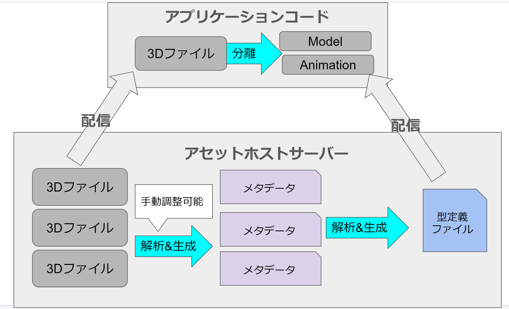

前回の記事は[こちら]()

前回説明したように、Babylon.jsにはキャラクターアニメーションを汎用的に取り扱うための抽象化レイヤーが存在しません。  
これを実現したいですが、よくよく考えるとそのような抽象化レイヤーの実現には3Dモデルを解析し、アニメーションの変換を行う何等かのランタイムが必要になります。一般的なゲームエンジンでは、これはエディタ機能として実現できるでしょう。  
しかしBabylon.jsは**ゲームエンジンではなくフレームワークです**。つまりそれ自体が単独で実行されるランタイムアプリケーションではなく、静的なファイルの塊です。  

そのためこの抽象化レイヤーはBabylon.jsで開発するアプリケーションとは別で実行されるプログラムとして存在する必要があります。(BJSフレームワークの機能として実現する方法ありますかね？私は残念ながら思いつきませんでした...)  
今回はシンプルに以下のような構成にすることとしました。  

Babylon.js上で3dモデルをインポートする際、http(s)経由で直接インポートできるのでそれを利用します。  
3Dモデルを配信するサーバーを用意し、そのサーバーに抽象化レイヤ機能を持たせます。  
サーバー上では３Dモデルを監視し、Skinnedなモデルであればそれを解析してメタデータを生成します。このメタデータ生成は人間が手動調整できるようにします。  
そのメタデータを元にTypeScriptコードを生成し、それと3Dモデルを合わせて配信することでアプリケーションコード側から3Dモデルの情報を静的解析できるようにする、という仕組みです。  

3Dモデルの解析にはbabylon.jsを使用し、その結果を元にTypeScript Compiler APIを利用してリフレクション定義コードを吐き出します。

この記事を今書いている次点ではこの解析サーバーもサンプルアプリケーションまだ完成しておらず、動作しません。多分1月末までには最低限動くものができると思います。完成したらこの記事に追記すると思います。

開発はサーバーはこの[リポジトリ](https://github.com/udemegane/bjs-asset-host-analyze.git)で、サンプルアプリケーションは[ここ](https://github.com/udemegane/bjs-character-animation-sample.git)で行っています。

