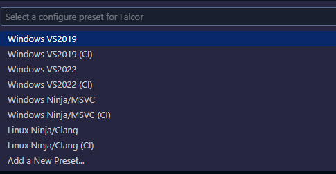
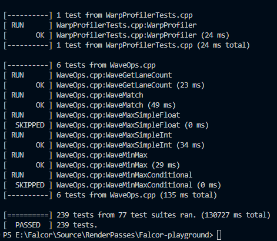
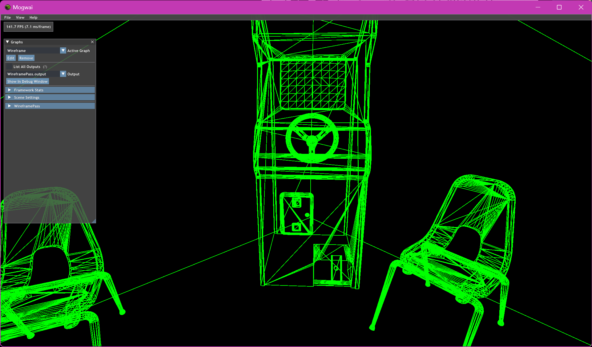

２週間ほど前にN天堂の面接があったのですが、その時Falcorリポジトリを覗いていたら6.0-previewの文字があってびっくり。面接官の前でおもいっきりｱｯ..ｱｯ...と呻く謎のムーブをかましてしましました。  
まあそんなどうでもいいことは置いておいてとりあえずアプデが来たのでビルドして動かしてみました。色々と破壊的変更があり、5.2のコードが動かなかったのでWireframe tutorialを6.0で実装しました。チュートリアル等のドキュメントは昔のままでした。（せっかく直したのにまた古くなってしまった、、、）  
`https://github.com/NVIDIAGameWorks/Falcor.git`からソースを引っ張ってきたら、FalcorTestをビルドします。  
なお、CMakeのConfigure presetsが少し変わっていますが名前を見ればどれを使えばよいかはすぐに分かると思います。私はVSCode/CLionで使用したいのでWindows Ninja/MSVCを選択します。  


なお、PCにインストールしていたOptixのバージョンが7.5だったため、OptixDenoiserPassで513エラーが起きました。(7.3が想定されているようです)  
コンパイルを通すだけなら以下のような修正で簡単に対応できます。 

- **OptixDenoiser.h**
```c++
- OptixDenoiserParams     params = { 0u, static_cast<CUdeviceptr>(0), 0.0f, static_cast<CUdeviceptr>(0) };
+ OptixDenoiserParams params = {
+           OptixDenoiserAlphaMode::OPTIX_DENOISER_ALPHA_MODE_COPY, static_cast<CUdeviceptr>(0), 0.0f, static_cast<CUdeviceptr>(0)};
```


- **OptixDenoiser.cpp** 
```c++
- else if (key == kDenoiseAlpha) mDenoiser.params.denoiseAlpha = (value ? 1u : 0u);
+ else if (key == kDenoiseAlpha)
+     mDenoiser.params.denoiseAlpha =
+         (value ? OptixDenoiserAlphaMode::OPTIX_DENOISER_ALPHA_MODE_ALPHA_AS_AOV
+                : OptixDenoiserAlphaMode::OPTIX_DENOISER_ALPHA_MODE_COPY);
```
```c++
- bool useNormalGuide = mDenoiser.options.guideNormal != 0u;
+ bool useNormalGuide = mDenoiser.options.guideNormal != OptixDenoiserAlphaMode::OPTIX_DENOISER_ALPHA_MODE_COPY;
```
```c++
 if (widget.checkbox("Denoise Alpha?", denoiseAlpha))
 {
-    mDenoiser.params.denoiseAlpha = denoiseAlpha ? 1u : 0u;
+    mDenoiser.params.denoiseAlpha = denoiseAlpha ? OptixDenoiserAlphaMode::OPTIX_DENOISER_ALPHA_MODE_COPY
+                                                 : OptixDenoiserAlphaMode::OPTIX_DENOISER_ALPHA_MODE_ALPHA_AS_AOV;
 }
```

サブモジュール含めて正常にcloneできていれば普通にビルドできて動くはずです。  
ただし、FalcorTestに関しては一度Mogwaiを起動して何かをレンダーしないと謎エラーで実行できませんでした。逆に言うと謎エラーで実行できなくても普通にMogwaiが動き、その後は正常にテストも動いて通りました。謎。  


---

本題はここからです。  
案の定レンダーパス周りのAPIが色々変わっており、6.0以前のコードはそのままでは動きません。そしてドキュメントは更新されていないのでソースコードを呼んでエスパーしながら対応をする必要があります。また、以前のコメントの通りForwardLightingPassやCSMなど一部のラスタライズ系パスが消滅していました。  
ただ、ざっと見た感じレンダーパスクラスでGPUデバイスを持つ変数を扱うようになった程度の変更なので、そこまで移植は大変じゃなさそうです。  
試しにチュートリアルのWireframePassを6.0対応させてみます。
ちょくちょく書き換える必要がありますが、例えばコンストラクタとかcreate()は以下のように変わります。


- 旧
```c++
WireframePass::SharedPtr WireframePass::create(RenderContext *pRenderContext, const Dictionary &dict)
{
    SharedPtr pPass = SharedPtr(new WireframePass());

    return pPass;
}

WireframePass::WireframePass() : RenderPass(kInfo)
{
    mpProgram = GraphicsProgram::createFromFile("RenderPasses/WireframePass/WireframePass.3d.slang", "vsMain",
                                                "psMain");
    RasterizerState::Desc wireframeDesc;
    wireframeDesc.setFillMode(RasterizerState::FillMode::Wireframe);
    wireframeDesc.setCullMode(RasterizerState::CullMode::None);
    mpRasterState = RasterizerState::create(wireframeDesc);

    mpGraphicsState = GraphicsState::create();
    mpGraphicsState->setProgram(mpProgram);
    mpGraphicsState->setRasterizerState(mpRasterState);
}

```

- 新
```c++
WireframePass::SharedPtr WireframePass::create(std::shared_ptr<Device> pDevice, const Dictionary& dict)
{
    SharedPtr pPass = SharedPtr(new WireframePass(std::move(pDevice)));

    return pPass;
}

WireframePass::WireframePass(std::shared_ptr<Device> pDevice) : RenderPass(std::move(pDevice))
{
    mpProgram = GraphicsProgram::createFromFile(mpDevice, "RenderPasses/WireframePass/WireframePass.3d.slang", "vsMain", "psMain");
    RasterizerState::Desc wireframeDesc;
    wireframeDesc.setFillMode(RasterizerState::FillMode::Wireframe);
    wireframeDesc.setCullMode(RasterizerState::CullMode::None);
    mpRasterState = RasterizerState::create(wireframeDesc);

    mpGraphicsState = GraphicsState::create(mpDevice);
    mpGraphicsState->setProgram(mpProgram);
    mpGraphicsState->setRasterizerState(mpRasterState);
}
```

デバイスの所有権は最終的にはRenderPassクラスのメンバであるmpDeviceが持っています。
```c++
RenderPass(std::shared_ptr<Device> pDevice) : mpDevice(std::move(pDevice)) {}
std::shared_ptr<Device> mpDevice;
```


そこらへんに注意しながら書き換えればいつものWireframe表示ができました。  
詳しくはソースコードを見てください。  
https://github.com/udemegane/Falcor-playground/tree/main/WireframePass  

