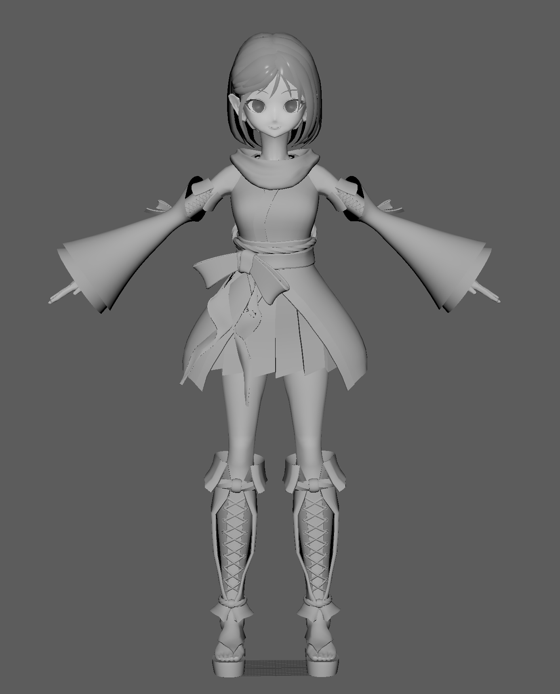
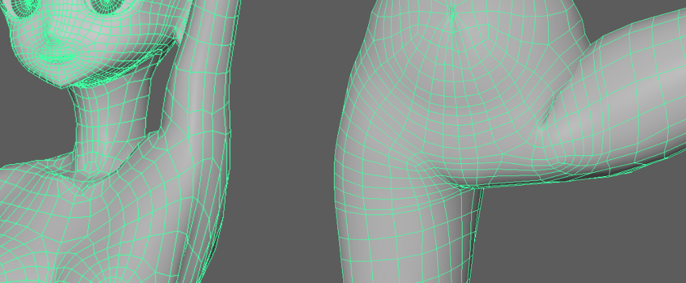
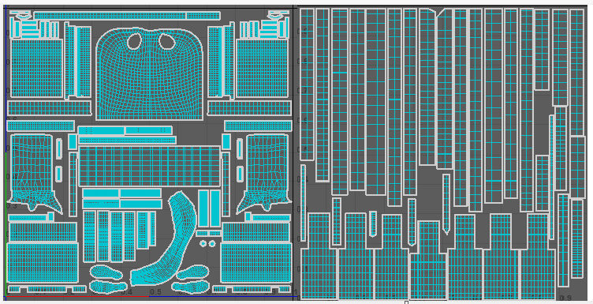
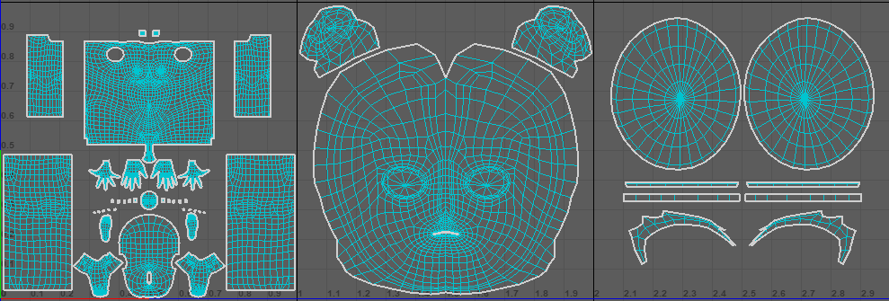
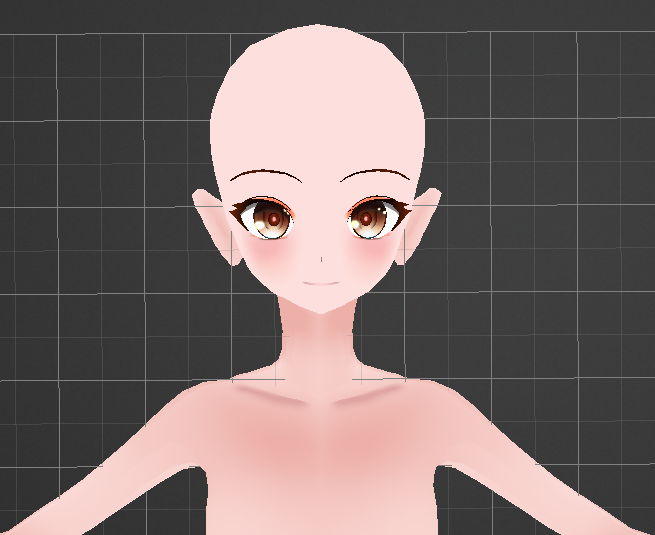
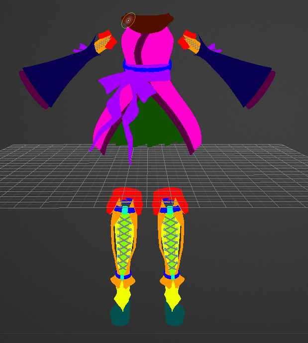
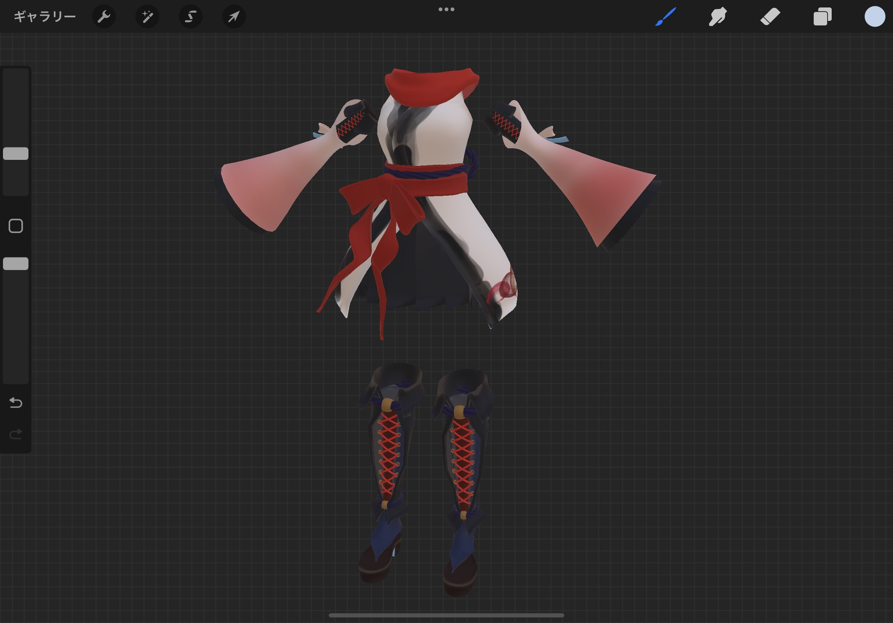

タイトルの通り。Maya+3Dcoat+SubstancePainter+(Blender、.babylon への変換用)で作成する。
ベースカラーしか使う予定ないので ZBrush の出番は無いが、もしかしたらしわのために使うかもしれん。

## モデリング&ウェイトペイント

実は 1 年くらい前に作って放置したやつがあったので、それを引っ張ってきて Maya で骨を入れる。
顔の造形などディティールに色々と不満があるが、細かいこと気にしだすと無限に終わらないので先に進む。
頂点の追加・削除さえしなければ微調整は後でも出来るので。

アニメーションは cascadeur で作る予定なので Rig は入れない。
また、髪の毛、服はポートフォリオサイト上でランタイム切替したいので別アセットとして作成してアプリケーション側で同期する。

ゲーム用モデル、かつランタイムリグで複雑な関節制御する予定が無いので補助ボーンとかは無し。
完ぺきではないが悪くはない気がする。

## UV

くっっっそだるかった。Maya の UV はかなり優秀（だと個人的に思っている）が、それでもだるい。
服・髪の UV↓

素体 UV↓

## テクスチャ

素体は手塗でやるので 3Dcoat を使う。

服・髪は Substance を使うが、Material-idMap が欲しいのでそれは 3DCoat で作る。3DCoat の塗りつぶしは賢い。

配色は全く決めていなかったのでとりあえず iPad で軽くアタリを付ける。
procreate で 3D ペイント、機能はかなり簡素だがめっちゃ軽くストレスフリーなのでちょっとした作業には凄く向いている。
左右対称のいらない手塗では最強クラスでは、と思ってしまった。
色々試したけど結局白+赤構成が一番しっくりくる。次点で黒+紫。

テクスチャの続き、リグなどはまだ終わっていないので次回以降の記事に書く。
