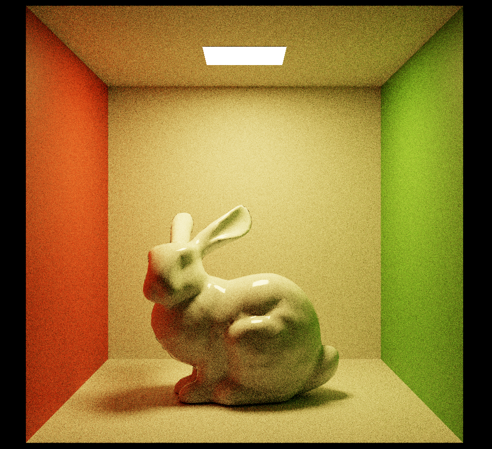
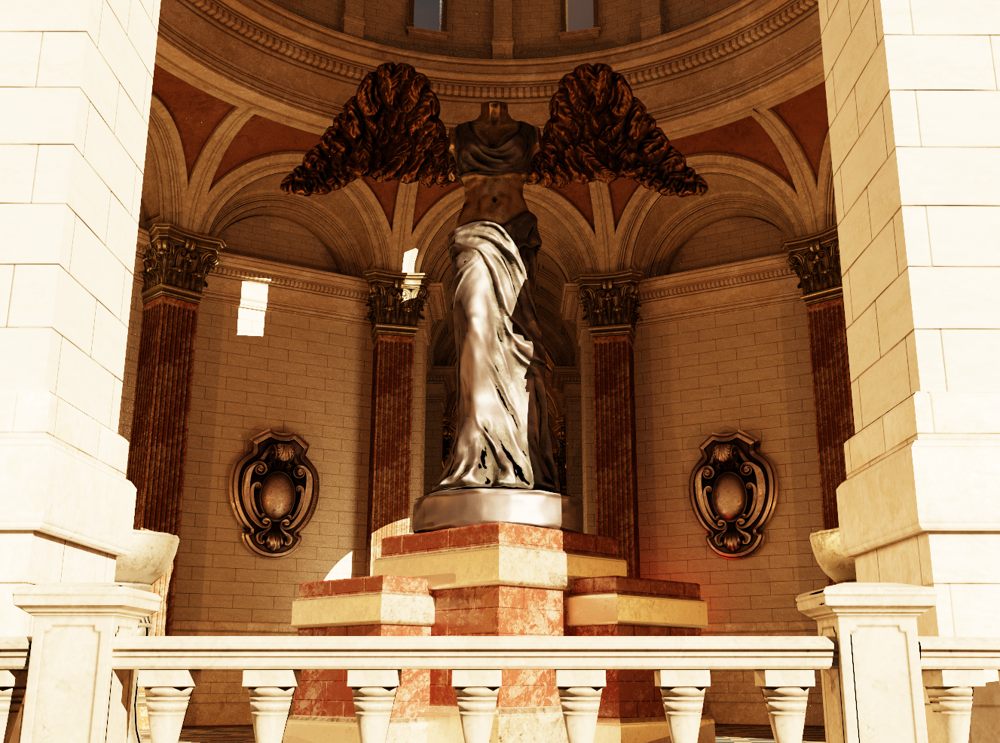

## 概要
[Falcorのチュートリアルを終えた]()ので次はもっと実用的なものを作ります。題材としてパストレーサーを選びました。リアルタイムレイトレーシング流行ってるので前からやってみたかったんですよね。ReSTIRの実装とか。その第一歩としてちょうどいいかなと思ってパストレーサーにしました。  
Falcorそのものの使い方を知りたいという目的もあるので、標準で提供されているMinimal Pathtracerを~~写経~~参考にして実装したためMinimalPathTracerとやっていることはほぼ同じです。

ソースコードは以下にあります。
https://github.com/udemegane/Falcor-playground/tree/main/5.2/TinyPathTracer

処理の流れとしては基本的にはナイーブなパストレーシングをしていますが、ちょっと変わっているのは**幾何光源**にはNEEを実行、マテリアルのEmissiveは**レイ衝突時に寄与を計算**していることです。
FalcorはラスタライズとHWレイトレースを統合して扱えるフレームワークですが、リアルタイムレンダリングにおいてマテリアルのEmissive値はSSGI等を使えばScreenSpace上ではある程度真面目に光源として計算できますが基本的にニセ光源なんですよね。
EmmisiveマテリアルもNEEの対象に入れようとしたらそのマテリアルが割り当てられてるオブジェクトのうち光ってるトライアングルの座標が必要になるので、結構めんどくさそうです。
ですから真面目な光源として簡単に扱おうとするととあぁこうなるのかぁとちょっと面白味を感じました。

Falcorはインポーターやマテリアルは一通り揃っているのでｲｲｶﾝｼﾞ3Dｼｰﾝを放り込むと良い感じの絵が出ます。



## 解説


rayのpayload typeは可視性評価と放射輝度評価のための2種類です。
```c++
// shadow ray strcuture
struct ShadowRayData
{
    bool visible;
}

// scatter ray structure
struct ScatterRayData
{
    float3 radiance;
    float3 throughput;
    float3 origin;
    float3 direction;
    uint pathLength;
    bool terminated;

    SampleGenerator sg;

    __init(SampleGenerator sg)
    {
        this.sg = sg;

        this.terminated = false;
        this.pathLength = 0;
        this.radiance = float3(0, 0, 0);
        this.throughput = float3(1, 1, 1);
        this.origin = float3(0, 0, 0);
        this.direction = float3(0, 0, 0);
    }
}
```

Falcorのジオメトリ定義は以下のようになっています。(Source/Falcor/Scene/SceneTypes.slang)
処理の対象とするジオメトリはIntersectionシェーダーもこれに合わせて書く必要があります。
```c++
enum class GeometryType : uint32_t
{
    None                    = GEOMETRY_TYPE_NONE,
    TriangleMesh            = GEOMETRY_TYPE_TRIANGLE_MESH,
    DisplacedTriangleMesh   = GEOMETRY_TYPE_DISPLACED_TRIANGLE_MESH,
    Curve                   = GEOMETRY_TYPE_CURVE,
    SDFGrid                 = GEOMETRY_TYPE_SDF_GRID,
    Custom                  = GEOMETRY_TYPE_CUSTOM,

    Count
};
```

あとは普通のパストレースですが、先に述べたように幾何光源とEmissiveで扱いが異なります。
```c++
let lod = ExplicitLodTextureSampler(0.f);
ShadingData sd = loadShadingData(hit, rayData.origin, rayData.direction, lod);
let bsdf = gScene.materials.getBSDF(sd, lod);
float3 rayOrigin;

//  eval hit-point emission contribution except for analytic light
//  and do next event estimation with analytic light
rayData.radiance += rayData.throughput * (bsdf.getProperties(sd).emission);
if (rayData.pathLength >= kMaxBounces)
{
    rayData.terminated = true;
    return;
}
rayData.radiance += rayData.throughput * evalDirectAnalytic(sd, bsdf, rayData.sg);
```
参考にしたminimalPathTracerがこうなってたのではぇ～こうやるんかと思いながら書きましが多分EmissiveもNEEできる気がするんですよね。EmmisiveLightHelperみたいな名前のヘッダファイルあったし。
やり方わかったら修正します。
あとは乱数生成機の挙動とかもまだちゃんと見てないんですよね。体感ですがそこそこ重たいんですけど何してるんでしょうこれ(Source/Falcor/Utils/Sampling/SampleGenerator.h　あたり)  
その他処理の内容はここ見ればすぐわかると思います。(https://github.com/udemegane/Falcor-playground/blob/main/5.2/TinyPathTracer/TinyPathTracer.rt.slang)