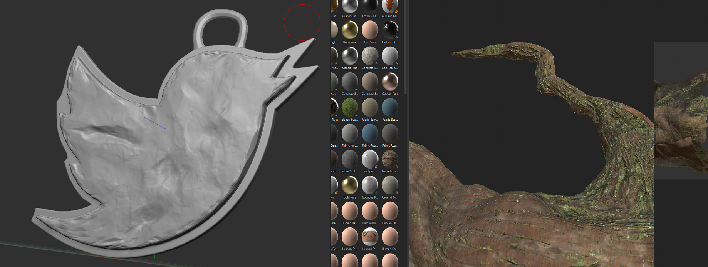
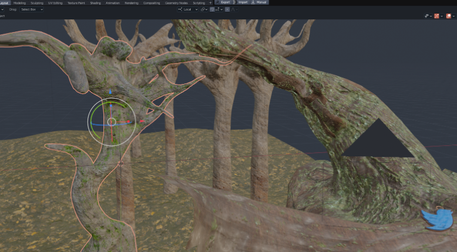
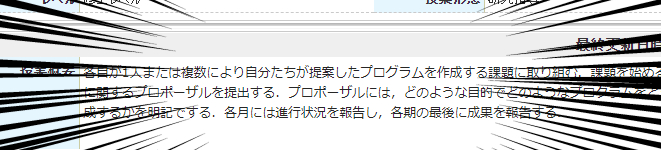

タイトルの通り。2~3年前から作ろう作ろうと思いながら全く手を付けられていなかったが、就活の時期も近いので作る。

とりあえずフル3DCGで作る。最低限以下の機能をつけたい。
- 自作キャラクターが居て生活している。
- twitterやらgithubやらのアイコンが自然に存在していて、押すと私のページに飛ぶ。
- なんかかっこいい

Webアプリケーションとしては死ぬほどシンプルで要件定義書くまでもないのでオタ駆動開発を敢行する。  

だが流石にスケルタルメッシュ周りの制御系や、物理シミュを一切のミスなく実装するのは無理があるので、そこらへんやり始めたらテスト駆動に切り替える。

## というわけで
作りましょう。
まずは背景シーンをZBrush+Maya+Substanceでちゃちゃっと作る。

私は背景モデラーではないし、目指してもいないのでクオリティがちょっと残念だがポストプロセスで誤魔化すので問題無し。

最終的には.babylon形式でアプリケーションに放り込むのでデータ整形用にBlenderをかましている。MayaにもBabylon.jsプラグインが一応あるが、恐ろしく動作が遅いので素直にBlenderに持って行ってそっちで色々やったほうが楽。スタティックメッシュなら受け渡しも楽なのでなおさら。

## Babylonjsアプリケーション
コードはここ。
https://github.com/udemegane/udemegane.net

TypeScript+Webpack+babylon.jsの構成
jestとcypressも突っ込んだが今のところテストできるところがあまりないので放置。

はい、、、良くないのは分かってます。個人開発だしいつかちゃんとやるので許してください。。。。。

とりあえず作った環境を放り込んでポスプロを色々かます。

あとはキャラクターを突っ込みたいが、babylonjsのアニメーション周りがとにかく扱いづらいのと、そもそもキャラクターが完成してないのでそっちを先にやる。

## 個人開発で単位がもらえる、嬉しい！！
これ大学の授業の課題も兼ねてるので7月末までには完成予定。というか完成させないと私の単位が危ない。
おめー普通の情報系の大学院通ってるのに大学の講義でテーマ自由の個人開発なんかあるわけないだろ、と思った方もいらっしゃるかもしれない。
**あるんだなこれが！！！！！！**

