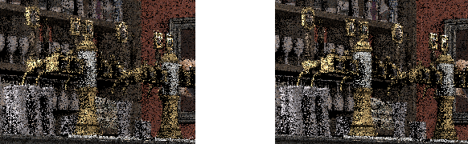
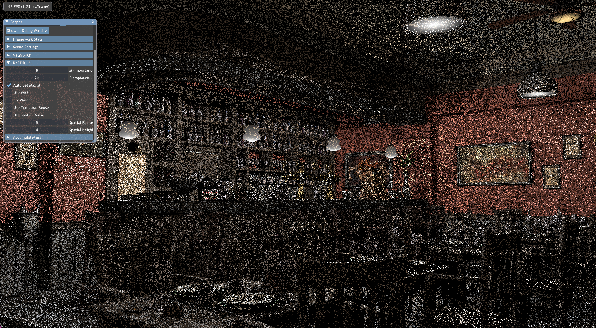
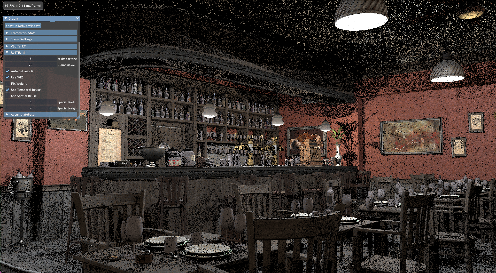
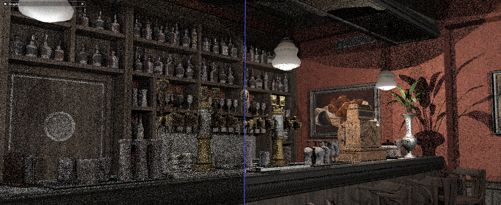

前回の記事は[こちら]()

前回、Weigted Reservoir Samplingの実装まで行ったので今回はSpatial Reuse / Temporal Reuseを実装していきたいと思います。  
SpatioTemporalReuseのアルゴリズム概要は以下のようになっています(論文より抜粋)。

これを見ると、SpatialReuse時にそのフレームで計算した近傍のReservoirを参照しているので、一つのシェーダーでReSTIRを実行することができないとわかります。今回はWRSを行うパスとSpatioTemporalReuseを行うパスに分けました。あとついでにInline Raytracingしてみました。**めっちゃ便利ですねこれ。**  
以下要点だけ簡単な解説です。  
ソースコードはここです: https://github.com/udemegane/Falcor-playground/tree/main/ReSTIR  
また、前回参考にした記事に加えて、[こちら](https://gamehacker1999.github.io/posts/restir/)も参考にしました。

## Reservoirとその結合
リザーバーを前回より少し変更して以下のようにしています。
```c++
struct RISReservoir
{
    float wSum;
    uint currentSampleId;
    float3 targetPdfSample;
    uint M;
    __init()
    {
        wSum = 0;
        M = 0;
        currentSampleId = 0;
        targetPdfSample = float3(0.f);
    }
    [mutating]
    bool update(const uint xi, const float wi, const float3 pi, const float rand)
    {
        wSum += wi;
        bool accept = rand <= wi / wSum;
        if (accept || M == 0)
        {
            currentSampleId = xi;

            targetPdfSample = pi;
        }
        M++;
        return accept;
    }

    float getInvPDF()
    {

        return wSum / (M * length(targetPdfSample));
    }
}
```

変更点は2箇所で、一つは選択したサンプルを使って目標分布からサンプルした値`targetPdfSample`をfloat3型にしています(つまり色の情報を捨てずに保持しておく)。これはそのリザーバーが保持しているサンプル`x`で目標分布からサンプルした値`p(x)`を色々なとこで使うので再計算する手間を省くためです。  
もう一つはサンプル更新の条件です。新たに`M==0`が加えてあります。これはリザーバーへの最初の入力を確実に保持させるためです。こうしないと場合によってはリザーバーが保持する値が初期値のままである可能性があります(特にリザーバーへのストリーム入力が一つしか無い時など)。実際多分それが原因でとんでもないアーティファクトが出たのでこうしました。  

リザーバーの結合は以下のように行います。論文のアルゴリズムと若干形が異なりますがやっていることは同じ(なはず)です。  
SpatioTemporalSamplingでは異なる目標分布(=異なるサーフェス位置)からサンプリングするのでウェイトを目標分布の比で修正する必要があります。
```c++
struct CombinedReservoirFactory
{

    RISReservoir master;
    uint M;
    __init()
    {
        master = RISReservoir();
        M = 0;
    }
    // Fix Weight
    [mutating]
    bool update(RISReservoir ri, float3 newPdfSample)
    {
        M += ri.M;
        float fixedW = ri.wSum * length(newPdfSample) / length(ri.targetPdfSample);
        return master.update(ri.currentSampleId, fixedW, newPdfSample, rand());
    }
    [mutating]
    bool update(RISReservoir ri)
    {
        M += ri.M;
        return master.update(ri.currentSampleId, ri.wSum, ri.targetPdfSample, rand());
    }
    [mutating]
    RISReservoir getCombinedReservoir()
    {
        master.M = M;
        return master;
    }
}
```

この修正を行わないと、目標分布の差異が原因のアーティファクトが発生します。


## SpatioTemporalReuse
上記のリザーバーと結合器を利用するとSpatial/Temporal Reuseは例えば以下のように実装できます。

### Temporal Reuse
論文ではTemporal Reuse時に前フレームからのリザーバー保持数`M`を現在の`M`の20倍に制限するように推奨していましたが、ここではシーンに存在する総数のライトの1/4に制限しています。そうしたほうが手元のシーンたと分散が減りましたが、ここらへんの数字は何が良いのかはわかりませんね。ただ、制限しないと`M`が無限に増え続けるので何かしらの上限を設けたほうが良いのは確かでしょう。
```c++
// WRSによって得られた現フレームのリザーバー
StructuredBuffer<RISReservoir> intermediateReservoir;
// 前フレームのリザーバー
RWStructuredBuffer<RISReservoir> prevFrameReservoir;

RISReservoir r = intermediateReservoir[pixel.x + gScreen.x * pixel.y];

int prevPixel = getPrevFramePos1D(pixel, gScreen);
if (prevPixel != -1)
{
    RISReservoir rprev = prevFrameReservoir[prevPixel];

    // clamp previous frame reservoir length.
    uint max = kUseAutoSetMaxM ? lightCount / 4 : kTemporalReuseMaxM;
    if (rprev.M > r.M * max)
    {
        float ratio = ((float)max * r.M / rprev.M);
        rprev.wSum *= ratio;
        rprev.M = max * r.M;
    }
    // combine reservoirs
    {
        CombinedReservoirFactory crf = CombinedReservoirFactory();
        crf.update(r);
        if (sampleLight(sd.posW, gScene.getLight(rprev.currentSampleId), sg, ls))
        {
            pi3f = bsdf.eval(sd, ls.dir, sg) * ls.Li;
            crf.update(rprev, pi3f);
        }
        r = crf.getCombinedReservoir();
    }
}
```

### Spatial Reuse
適当に現ピクセルの近傍から幾つかのピクセルを選択してリザーバーの結合を行います。深度が±5%以内に無い時はスキップします。
```c++
// WRSによって得られた現フレームのリザーバー
StructuredBuffer<RISReservoir> intermediateReservoir;
// 前フレームのリザーバー
RWStructuredBuffer<RISReservoir> prevFrameReservoir;

RISReservoir r = intermediateReservoir[pixel.x + gScreen.x * pixel.y];

CombinedReservoirFactory crf = CombinedReservoirFactory();
crf.update(r);

for (uint i = 0; i < kSpatialNeigborsNum; i++)
{
    float rand = rand();
    float radius = kSampleRadius * rand;
    float angle = 2.0f * M_PI * frac(sin(gFrameCount * rand));
    uint2 neighborPos = {
        clamp(pixel.x + uint(radius * cos(angle)), 0, screen.x),
        clamp(pixel.y + uint(radius * sin(angle)), 0, screen.y)
    };

    // Skip loop when neighbor pixel is too far.
    if (gDepth[pixel] > 1.05 * gDepth[neighborPos] || gDepth[pixel] < 0.95 * gDepth[neighborPos])
    {
        continue;
    }

    {
        RISReservoir rn = intermediateReservoir[neighborPos.x + screen.x * neighborPos.y];

        float3 pi3f = float3(0.f);
        AnalyticLightSample ls;
        if (sampleLight(sd.posW, gScene.getLight(rn.currentSampleId), sg, ls))
        {
            pi3f = bsdf.eval(sd, ls.dir, sg) * ls.Li;
            crf.update(rn, pi3f);
        }
    }
}
r = crf.getCombinedReservoir();
```

## 結果
以下のようになりました。

---







(あれ...?SpatialReuseしたら逆にノイズ増えてね..?)


---

Spatial Reuseが微妙にうまく行ってない気もしますが比べてみるとかなりノイズは減っています。


半透明の処理をサボっていたりとちょくちょく穴はありますがとりあえずある程度は元論文の再現ができました。次は何しようかなぁ