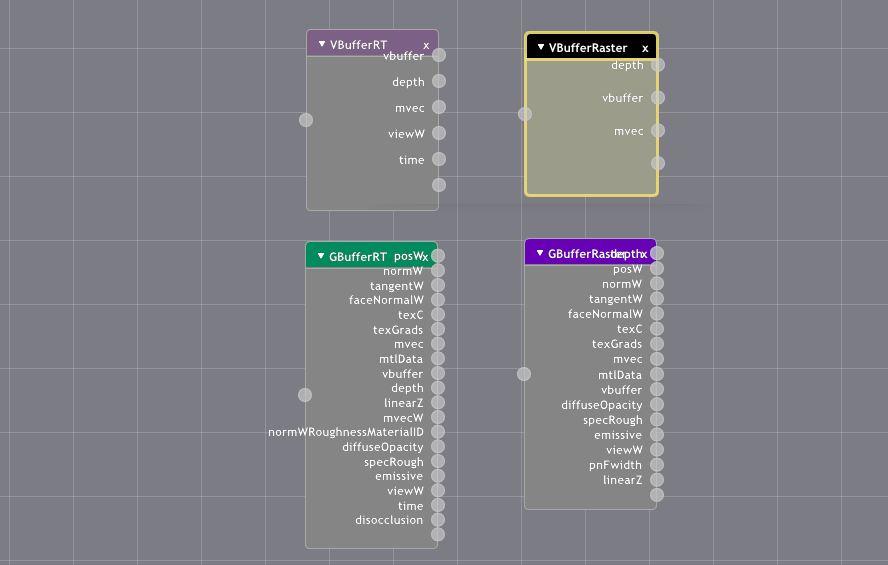
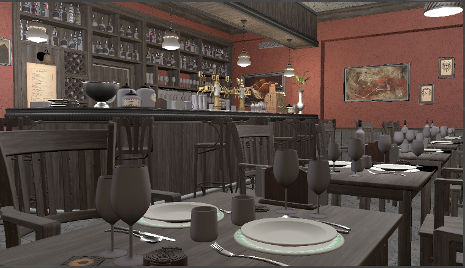
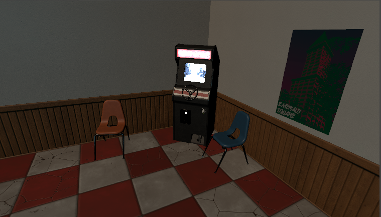
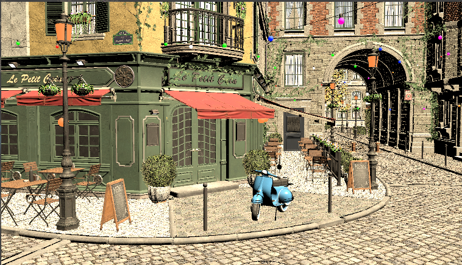
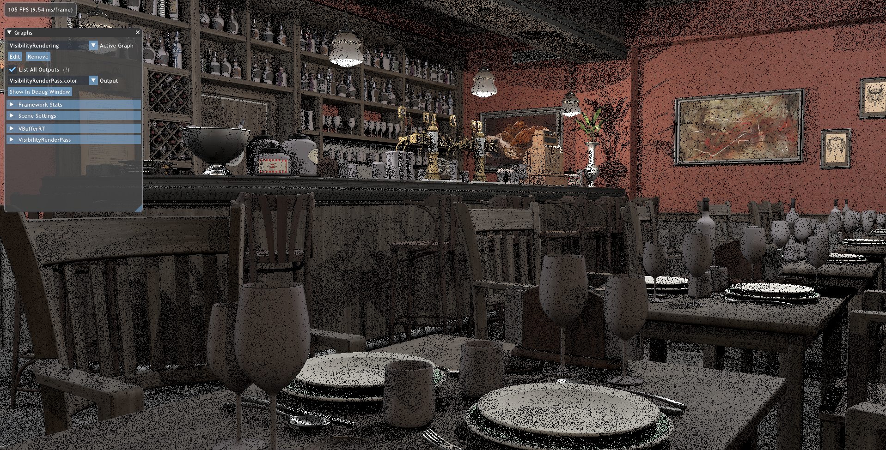
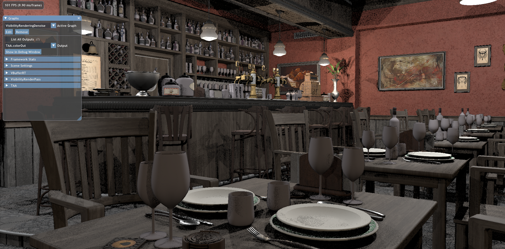

前回ReSTIRを作成しましたが、普通にラスタライズパイプラインでレンダーしたものとの比較が気になりました。  
ところがFalcorには普通のラスタライズシェーディングがありません。一応ForwardLightingPassというものがありますが現行バージョンだと動かないらしいです。開発者曰く"We're fully focusing on real-time path tracing and the raster passes have been neglected for a long time. They are far from state-of-the-art"([参考](https://github.com/NVIDIAGameWorks/Falcor/issues/332))とのことなので、メンテナンスする気も無いようです。  
無いなら作ってしまえということで、シンプルなシェーディングパスを作成しました。  
Faclorは標準でGBufferとVBufferが提供され、また各種BSDFも充実しているのでトラディショナルな実装なら簡単に作れると思います。

ちなみにGBufferは20枚近くあるクソデカです。研究用フレームワークとしての割り切りを感じる...

というわけでVBufferを使ってVisibilityRenderingをしてみましょう。  
VBufferに関してはここらへんを参照してください。↓
- https://jcgt.org/published/0002/02/04/
- http://filmicworlds.com/blog/visibility-buffer-rendering-with-material-graphs/

できました。ここまでお膳立てされていれば簡単ですね。  

次はシャドウです。さっさと絵を得たかったのでレイトレースシャドウを使いました（WRS使用）。CSMPassなんてのもありましたがどうなんでしょう、ちゃんと動くんでしょうかねあれ？

あれぇ... ReSTIRより若干綺麗に見えるぞ.... 

 TAAかけたら一気に綺麗になりました。影はかなりノイズが目立ちますが。
フレームレートは同条件下だとReSTIRのほうが1割ほど上でしたが、休日の突貫工事で作ったものなので様々な面で大いに改善できるところがあります。  
ReSTIRは影計算にだけ使って直接照明はラスタライズでやるハイブリッドパイプラインとかのほうが生ReSTIRより全然良い結果が得られそうですね。うまくやればFPSもReSTIRとそんな変わらない気がするし。しかもGBufferを用意すればReservoir＋GBufferがポストプロセスで使えるようになるので色々面白いことができそうです。半透明サボってるのも気持ちが悪いし、VBufferベースでちょっと色々やってみようかな。

ソースコードはこちら: https://github.com/udemegane/Falcor-playground/tree/main/VisibilityRenderPass